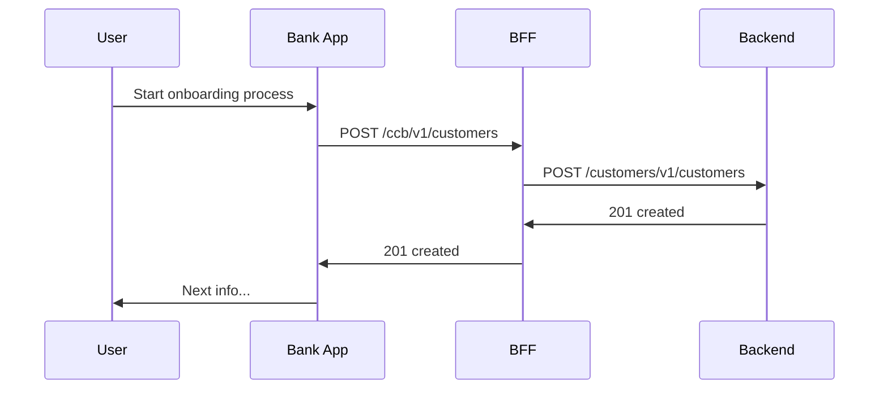

# Loans 

## Accounts Lending
Account lending is used by Pay in 4 Instalment product (PI4)

Description of business domain and product.

<!-- theme: success -->

> 💡 Check the [Account Lending technical specification](/reference/Account-Lending.yaml)!

### Business flow

TBD

### Data Model and Entity Diagram

Include documentation about the data model here

### Gloassary
Optional

### Account statuses for Richmond

---

Customer availing the Richmond proposition will have two accounts. One Limit Account which controls the financing power and multiple individual PI4 Loan accounts that Customer opens, utilizing the limit set on limit account, on the back of an eligible debit card transaction posted on qualified checking accounts.

GBP Account Lifecycle Status manages journey of the account from the point Richmond accounts are Opened till it's end of life on GBP. Attached spreadsheet outlines the statuses for Richmond accounts, transitions that enable Customer journeys and also business rules applicable.

**Account Statuses for PI4 Loan**

\[PI4 Account Lifecicly GBP 04272022.xslx]

**Account Statuses for PI4 Limit**

\[PI4 Limit Account Lifecicly GBP 04262022.xslx]

### Lending Account Management Model

---

\[a link to Lending Data model here]

### Lending Events

---

All events will be published in the same topic

**prod** : gbp-account_mgmt-account /  **non-prod** : gbp-account_mgmt-account-\<env>

\[LendingAccountCreated link here ]

\[LendingAccountUpdated link here] (for the first release of Richmond it includes status changes)

#### AccountCreated Event

**Event Header**

| Logical Attribute                                                 | Data Type     | Logical Type     | Size   | Physical Key (wire) | Description                                                                                                                                                                                                                          |   |   |   |   |   |   |
| ----------------------------------------------------------------- | ------------- | ---------------- | ------ | ------------------- | ------------------------------------------------------------------------------------------------------------------------------------------------------------------------------------------------------------------------------------ | - | - | - | - | - | - |
| Event ID                                                          | String        | uuid             | 36     | id                  | *Uniquely identify an event with   UUID preferred  *ALT-UUID  accepted as an exception, must follow UUID canonical format (8-4-4-4-12) as hex digits.                                                                            |   |   |   |   |   |   |
| Event Type Name                                                   | String        | -                | -      | sub                 | *Aligns closely to Autonomous app within a bounded context   *<Event TypeName>   e.g.   <ChangeCreditCardAddress>.  This is as large as it needs to be 128 or even 256)                                                          |   |   |   |   |   |   |
| Event   Type Schema Version                                       | Integer       | -                | -      | ver                 | Schema Version <Version Number> - Assume Major.  Integer aligns with most schema registries.                                                                                                                                         |   |   |   |   |   |   |
| Source   Context *Application (SEAL) ID *Application Module       | String String | -                | 64  64 | appid appnm         | Information about Event originator (publisher) and timestamp  *Application ID – SHOULD be a valid value registered in SEAL   *Application Module – SHOULD be a valid value registered in SEAL                                    |   |   |   |   |   |   |
| Execution Timestamp                                               | Long          | timestamp-millis |        | exects              | Time event/message occurred. Time is in milliseconds from UTC.                                                                                                                                                                       |   |   |   |   |   |   |
| Published Timestamp                                               | Long          | timestamp-millis |        | pubts               | Time event/message was published to the bus. Time is in milliseconds from UTC.                                                                                                                                                       |   |   |   |   |   |   |
| Event Monitoring & Tracing        All UUIDs are canonical format. |               |                  |        |                     |                                                                                                                                                                                                                                      |   |   |   |   |   |   |
| Correlation ID                                                    | String        |                  | 28     | corr                | Correlation ID -   Long running X-Channel correlation (Initial customer contact via any channel   or app will populate this field). You MAY include.                                                                                 |   |   |   |   |   |   |
| Session ID                                                        | String        |                  | 128    | sess                | SessionID –   New Session ID will be created every time a customer enters a new channel   (CPO, PRAESTO, Call center etc…). You MAY include.                                                                                         |   |   |   |   |   |   |
| Format                                                            | Enum          |                  | -      | fmt                 | Enumeration matching the symbols: AVRO_BIN, AVRO_JSON. If not set it will default to AVRO_BIN. Defines the serialization format used for the underlying unencrypted message. This will be encoded as an Integer. You SHOULD include. |   |   |   |   |   |   |
| Tracing Context                                                   | String        |                  | -      | b3                  | B3 trace context conforming to API standards:   b3={x-b3-traceid}-{x-b3-spanid}-{if x-b3-flags 'd' else x-b3-sampled}-{x-b3-parentspanid}, where the last two fields are optional.                                               |   |   |   |   |   |   |
| SpecVersion                                                       | String        |                  | 2      | specVersion         | Literal string '3' for this version of the spec. Byte value should be 0x33.                                                                                                                                                          |   |   |   |   |   |   |

**Event Body**

| Field name                        | Description                                                                                                                                                                                                                                                                                                                                                                                                                                                                                | Type       | Value                                                                                                                       |
| --------------------------------- | ------------------------------------------------------------------------------------------------------------------------------------------------------------------------------------------------------------------------------------------------------------------------------------------------------------------------------------------------------------------------------------------------------------------------------------------------------------------------------------------ | ---------- | --------------------------------------------------------------------------------------------------------------------------- |
| firmwideInternalAccountIdentifier | A unique identifier which references an account. This is generated by GBP. Used for servicing                                                                                                                                                                                                                                                                                                                                                                                              | UUID       | dc3bc0a0-f1cb-11ea-9854-e5ed1464197f                                                                                        |
| enterprisePartyIdentifier         | The Firm-declared authoritative unique identifier assigned to an external party involved in some manner with the Firm. This is a system-generated element that uses party name, address, and Tax Government Issued Identifier to define a unique individual or non-individual. The identifier is used for operational purposes. This critical data element is commonly referred to as the ECI (Enterprise Customer ID) or ECID and was formerly called the Enterprise Customer Identifier. | string(10) | 444444                                                                                                                      |
| bankIdentifier                    | An identifier which represent the portfolio of a product or a geographical region footprint  Richmond - 0000000802                                                                                                                                                                                                                                                                                                                                                                     | string     | 0000000802                                                                                                                  |
| productIdentifier                 | Uniquely identifies the product type in the Enterprise Products and Services (EPS) taxonomy against which a transaction, balance, trade or position can be related. A product type is a classification of financial instrument or service used for firmwide financial and risk internal or external reporting.   090- Richmond  012 - Deposits                                                                                                                                     | string     | 090                                                                                                                         |
| subProductCode                    | A breakdown of product within the product code.   001 - Parent Account  002 - PI4 installment loan                                                                                                                                                                                                                                                                                                                                                                                 | string(3)  | 001                                                                                                                         |
| costCenterIdentifier              | Identifies a unique occurrence of the organization within the Firm to which financial transactions can be allocated.                                                                                                                                                                                                                                                                                                                                                                       | string(10) | 12234556                                                                                                                    |
| ownershipTypeCode                 | Codifies the type of legal entity that has primary possession rights over the arrangement.                                                                                                                                                                                                                                                                                                                                                                                                 | string(3)  | 211                                                                                                                         |
| accountOpenDate                   | Official date in which the account should appear as opened. This field will be stored in string format 'YYYY-MM-DD'  YYYY is the year, MM is the month, and DD is the day when the account was first opened on the system.                                                                                                                                                                                                                                                                 | string     | 2022-03-24                                                                                                                  |
| accountClosedDate                 | Official date in which the account should appear as closed. This field will be stored in string format 'YYYY-MM-DD'  YYYY is the year, MM is the month, and DD is the day when the account was first opened on the system.                                                                                                                                                                                                                                                                 | string     | 2022-03-24                                                                                                                  |
| accountLastFour                   | Last four digits of the AEN                                                                                                                                                                                                                                                                                                                                                                                                                                                                | string     |                                                                                                                             |
| createTimestamp                   | Timestamp in which the account was actually created in GBP                                                                                                                                                                                                                                                                                                                                                                                                                                 | string     | 2022-03-08 14:25:03.000984 +00:00                                                                                           |
| lifecycleStatusCode               | Codifies the condition of the account. Possible values are:  Parent TBD  Child TBD                                                                                                                                                                                                                                                                                                                                                                                                 | string     | O                                                                                                                           |
| lifecycleStatusName               | The condition of the account. Possible values are:   Parent TBD   Child TBD                                                                                                                                                                                                                                                                                                                                                                                                        | string     | Open                                                                                                                        |
| additional                        | Free form key-value field to store product-specific info.                                                                                                                                                                                                                                                                                                                                                                                                                                  | Map        | {"limitAccountId": "01a00b3a-250d-46a9-865f-4ace00866edc",  "originalAmount": {"value": 200.00,"currencyCode": "USD"} } |

### Lending Sequence diagrams

---

**Account creation**

\[Account creation link here]

> Not valid diagram showed only for demo. Original link or image can be added

**Account Open - Business view**

\[Account Open Business view link here]

### Technical documentation 

#### Lending Accounts API Definition:

[Example for Swagger petstore](https://petstore.swagger.io/v2/swagger.json)

\[Open Api Spec]\(Include valid yaml file for accounts lendings)
